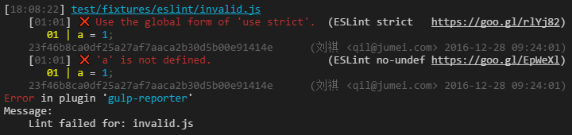

gulp-reporter
======

[](https://www.npmjs.com/package/gulp-reporter)
[](https://travis-ci.org/gucong3000/gulp-reporter)
[](https://ci.appveyor.com/project/gucong3000/gulp-reporter)
[](https://coveralls.io/r/gucong3000/gulp-reporter)

Error report localization for:
[CSSLint](https://github.com/lazd/gulp-csslint)
[EditorConfig](https://github.com/jedmao/eclint)
[ESLint](https://github.com/adametry/gulp-eslint)
[HTMLHint](https://github.com/bezoerb/gulp-htmlhint)
[JSCS](https://github.com/jscs-dev/gulp-jscs)
[JSHint](https://github.com/spalger/gulp-jshint)
[PostCSS](https://github.com/StartPolymer/gulp-html-postcss)
[TSLint](https://github.com/panuhorsmalahti/gulp-tslint)

Analyzing blame of the error, only fail for new error and error written by the current GIT user.

## Install

```bash
npm install gulp-eslint
```

## Usage

```js
gulp.src('test/fixtures/eslint/invalid.js')
	.pipe(eslint())
	.pipe(reporter(options));
```



## API

```js
reporter(options)
```
or

```js
reporter((file) => options)
```

### options.browser

Type: `boolean`

Default: `false`

[Report error messages right in your browser.](http://postcss.github.io/postcss-browser-reporter/screenshot.png)

### options.console

Type: `boolean|function`

Default: `true`

Report error messages in [gutil.log()](https://github.com/gulpjs/gulp-util#logmsg) or your function

### options.sort

Type: `boolean|function`

Default: `true`

Messages will be sorted by fileName/severity/line/column, [or your function](https://developer.mozilla.org/en/docs/Web/JavaScript/Reference/Global_Objects/Array/sort#Parameters).


### options.author
Type: `{name?: string|RegExp, email?: string|RegExp}`

Default: Read from GIT pre-commit environment and fallbacks with GIT commad `git log --max-count=1 --no-merges`

Demote each error that is not belong to specified author to a warning.

### options.expires

Type: `string` for [time periods](https://www.npmjs.com/package/to-time#usage), `number` of unix timestamp, `Date`

Demote each error that created before the specified time to a warning

### options.maxLineLength

Type: `number`

Default: 512

Demote each error in lines that length greater than this threshold.

### options.fail

Type: `boolean|function`

Default: `true`

Stop a task/stream if an error has been reported for any file, but wait for all of them to be processed first.
